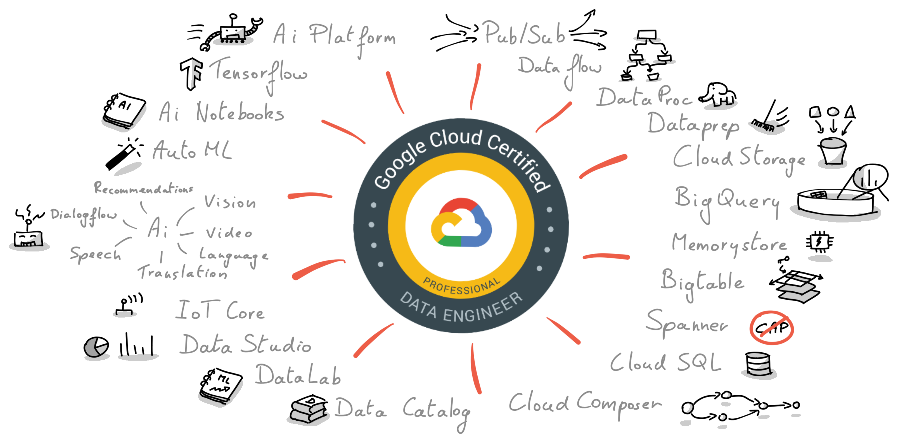

<h1 style="color:green">Google Cloud Platform- Professional Data Engineer </h1>

## 
A Professional Data Engineer makes data usable and valuable for others by collecting, transforming, and publishing data. This individual evaluates and selects products and services to meet business and regulatory requirements. A Professional Data Engineer creates and manages robust data processing systems. This includes the ability to design, build, deploy, monitor, maintain, and secure data processing workloads.

The Professional Data Engineer exam assesses your ability to:

- Design data processing systems
- Ingest and process data
- Store the data
- Prepare and use data for analysis
- Maintain and automate data workloads
- Design for reliability
- Design for security and compliance
- Analyze data and enable machine learning

##  Test format
- The exam consists of 50 questions that must be answered in 2 hours.
- The questions are either multiple choice (pick one correct answer) or multiple answer (pick M of N possible answers). Questions can be marked for review later.
- The multiple choice questions are "classic" in the sense that two of the answers can be eliminated immediately. Some detail in the question will bias the choice of the remaining answers.
- The exam is taken on a computer and you will not have access to pen and paper.
- The screen is split in half. The left side contains the questions while the right side contains the case studies.
- The two case studies that are published online were the two case studies used in the exam. The exam is setup so that all of the questions pertaining to a particular case study appear together.

## Study Approach for GCP Professional Data Engineer Certification

Earning the GCP Professional Data Engineer (PDE) certification validates your skills in designing, building, and managing data processing systems on Google Cloud. Here's a study approach to help you prepare:

**1. Assess Your Background:**

* **Start by understanding the exam requirements and recommended experience (3+ years in data engineering, 1+ year with Google Cloud).**
* **Evaluate your existing knowledge in data engineering and cloud fundamentals.** Do you have a solid understanding of data pipelines, data warehousing, data storage, and data analysis?
* **Identify any knowledge gaps and prioritize areas that require more focus.**

**2. Follow Official Resources:**

* **Start with Google's official resources:**
    * **Professional Data Engineer Certification Exam Guide:** [https://cloud.google.com/learn/certification/data-engineer](https://cloud.google.com/learn/certification/data-engineer)
    * **Data Engineer Learning Path:** [https://www.cloudskillsboost.google/paths/16](https://www.cloudskillsboost.google/paths/16)
    * **Sample questions and practice tests:** [https://www.testpreptraining.com/certified-professional-data-engineer-practice-exam](https://www.testpreptraining.com/certified-professional-data-engineer-practice-exam)
* **Complete the Google Cloud Platform Fundamentals for Data Engineers course:** This free course provides a solid foundation in GCP concepts and services relevant to the exam.

**3. Expand your knowledge:**

* **Enroll in online courses or training programs:** Several reputable platforms offer comprehensive courses specifically designed for the GCP PDE exam. Consider platforms like A Cloud Guru, Udemy, Coursera, or Pluralsight.
* **Read books and articles written by Google Cloud experts:** These resources offer deeper insights into specific topics and real-world case studies. Examples include "Designing Data-Intensive Applications" by Martin Kleppmann and "GCP Data Engineering Cookbook" by Arnaud Mancho.
* **Follow Google Cloud blogs and communities:** Stay updated on the latest developments and get insights from industry experts. Resources include the Google Cloud Blog, the Google Cloud Community forum, and the Google Data Cloud YouTube channel.

**4. Hands-on experience:**

* **Set up a Google Cloud account and explore the various services.** Experiment with data ingestion, processing, storage, and analysis tools to solidify your understanding.
* **Complete labs and hands-on exercises:** Several resources provide hands-on practice with GCP services relevant to the exam. Examples include the Qwiklabs platform and the Google Cloud Skills Boost program.
* **Work on personal projects or contribute to open-source projects:** These activities provide a valuable opportunity to apply your knowledge and gain practical experience.

**5. Practice and Assessment:**

* **Take mock exams and practice quizzes:** These resources help you assess your understanding and identify areas that need improvement.
* **Form a study group with other data engineers preparing for the exam:** Discuss concepts, share resources, and motivate each other.
* **Review the official practice questions and sample answers:** Focus on understanding the reasoning behind the correct answers.

**6. Time Management and Planning:**

* **Create a study schedule and dedicate time each day or week to preparing.**
* **Set realistic goals and track your progress.**
* **Prioritize topics based on your strengths and weaknesses.**
* **Don't hesitate to seek help from experts or online communities when you get stuck.**

**Additional Tips:**

* **Focus on understanding the underlying concepts, not just memorizing facts.**
* **Practice answering scenario-based questions, which are heavily emphasized in the exam.**
* **Take care of yourself and manage stress effectively.**
* **Stay motivated and believe in yourself!**

By following this comprehensive study approach and dedicating consistent effort, you'll be well-prepared to pass the GCP Professional Data Engineer certification exam and achieve your career goals.

## Acquire Hands-On Experience

| No | Resource | Lab  |
|---|---|---|
|  1 | Cloud Function | - |
|  2 | Cloud Run | - |
|  3 | Service Account | - |

## References
- [Jorwalk- Data Engineering GCP](https://github.com/jorwalk/data-engineering-gcp)
- [Google Bard AI](https://bard.google.com/)