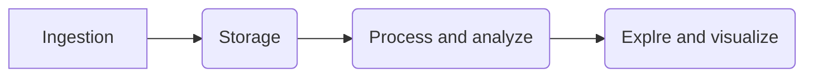
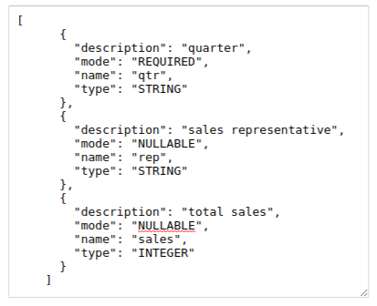

## Data Engineering Overview

1. Data pipeline
2. How data flows

### Ingest
- Gather data from multiple sources
- Data gather from app
  - event log, click stream data, ecommerce transaction ..

- Streaming ingest
    - pubsub

- Bacth ingest
    - Different transfer services
    - GCS - gsutil
### Store:
### Process and analytic:
 1. Cloud Dataproc
  - Existing Hadoop, Spark Application
  - Machine learning, Data science ecosystem
  - Tuneable cluster parameters
 2. Cloud Dataflow
  - New Data processing pipeline
  - Unified streaming and batch
  - Fully managed , No ops
 3. Cloud Data Prep
  - UI-Driven data preparation
  - Scale on demand
  - Fully managed, No ops
### Types of Data - Structure
 1. Structured : 
  - Tabular
  - Represented by Rows and Columns
  - SQL can be used to interact with data
  - Fixed Schema
  - Eache row has same number of columns
  - Relational db are structured data
  - My SQL, MSSQL, Postgres,
  - GCP Bigquery, Cloud SQL

  `Example:`
  
 2. Semi-structured
  - Each Record is same number of properties
  - No fixed schema
  - Flexible structure
  - NoSQL kind of data
  - store data as key-value pair
  - Json
  - Database: MongoDB, Cassandra, Neo4j, Redis
  - In GCP: Bigtable, Memorytable, Datastore

  `Example:`

  

 3. Unstructured
 - No pre define structure in data
 - Image
 - Natural language
 - In GCP: Google cloud storage, 