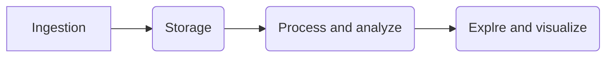
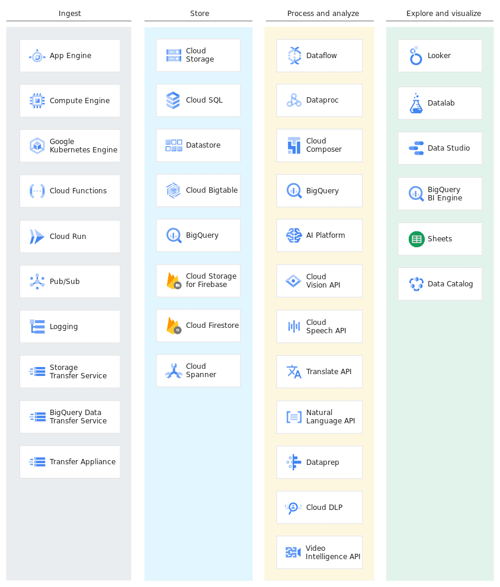

## Data Engineering Overview

1. Data pipeline
2. How data flows

### Ingest
- Gather data from multiple sources
- Data gather from app
  - event log, click stream data, ecommerce transaction ..

- Streaming ingest
    - pubsub

- Bacth ingest
    - Different transfer services
    - GCS - gsutil